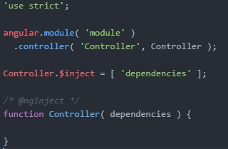
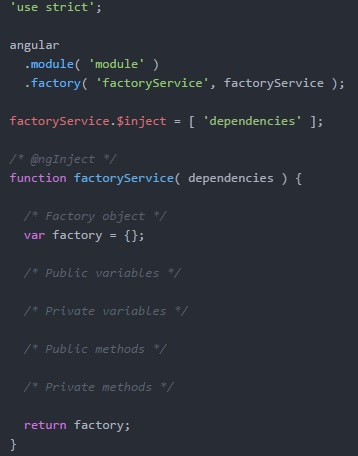
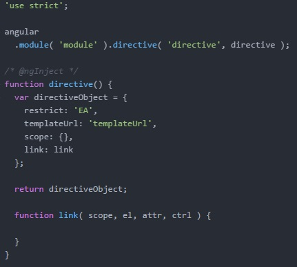
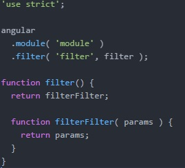

# Saturn

The aim of Saturn is help no-profit organization with the subscribers and network community management.

Often little organizations can't buy a huge and strong CRM because it's too expansive or simply they want a software with less features.

So, Saturn enable users to organize own accounts and subscribers, manage the newsletters and subscribers with a mailchimp integrator (if they use mailchimp) and manage the archive or library of the organization.

## What kind of technologies we use?
**Server side**:
Nodejs v4.2.4 or later + loopback

**DB**:
NoSQL (MongoDB or ArangoDB not decided yet)

**Client side**:
AngularJS 1.5.*

## How can I contribute to develop this idea?
I will open many issues inside this repository, so you can keep one and develop the feature required.

## Are you a Nodejs and AngularJS developer with a good experience?
Take an issue, and help me to develop features. Create your branch and keep in touch with me for merging in master when you finish.

## Are you newby but want learn and improve your skill in Nodejs and AngularJS?
Okay no problem, create a new branch and try to understand the code. Could be a great opportunity to learn these frameworks

My suggestion is:
Start with AngularJS, read the [Jhon Papa style guide](https://github.com/johnpapa/angular-styleguide/blob/master/a1/README.md), with a good book. Start to develop little example and when you're ready, develop some features in your branch.

**Please be sure to be really ready**
For me, is really important write a good and readable code. Dirty code is not permitted in this repository.

## Setup

1. Install Node.js ([Download page](https://nodejs.org/en/))

* Download the repository at: https://github.com/carmelolg/saturn.git

* Open Node.js terminal and go to the folder of project

* Run `npm install` and then `bower install`

* Run `grunt serve` and then at **localhost:9000** it will open saturn app.

# Rules
--------

## Generic
1. Official language is English.
* All commits have to be correctly described (I hope in your clarity).
* Branch name must be composed by your nick_feature.

## Front-end

### Variables files and names

Prefix filename list:
* controller: `controller-`
* service: `service-`
* filters: no prefix
* directive: `directive-`
* constants: `constants-`

Suffix function name list:
* controller: `Controller`
* service: `Service`
* filters: no suffix
* directive: no suffix
* constants: `Constant`

Function name rule:
* controller: start with lowercase
* service: start with lowercase
* filters: no rule
* directive: CamelCase only if is useful
* constants: start with Uppercase

#### Controller

Controller structure is as follows:

#### Service

([*Service vs Factory*](http://stackoverflow.com/questions/15666048/angularjs-service-vs-provider-vs-factory))

Factory structure is as follows:

#### Directive

Directive structure is as follows:

#### Filters

Filters structure is as follows:

